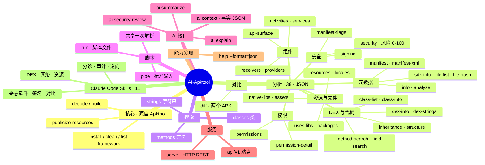

# AI-Apktool Skills

> 面向 Claude Code 的 AI 原生 Android 逆向工程工具 —— 11 个 Skills 与 50+ 个 CLI 命令，覆盖 APK 分析、安全审计与代码探索。

[English](README.md) | **简体中文**

[](LICENSE.md)
[](#skills包含-11-个)
[](#cli-命令参考)

AI-Apktool 将 [Apktool](https://apktool.org) 改造为一个 AI 原生的逆向工程平台。所有分析能力均输出结构化 **JSON**，因此 Claude Code（或任意 LLM 智能体）无需解析人类可读日志即可直接对 APK 进行推理。它以一组 Claude Code **Skills** 形式交付，并附带统一的 `apktool` CLI 与可选的 HTTP API。

---

## 核心亮点

- **11 个 Skills** 覆盖完整的 APK 工作流 —— 从 5 秒快速分诊到深度 DEX 继承链追踪与恶意软件狩猎。
- **51 个 CLI 命令**，分为 7 大类 —— 所有分析命令均输出 JSON，可直接交给 `jq` 或 LLM。
- **批量脚本** —— 通过 `run` / `pipe` 在一次解析中对同一个 APK 运行数十条分析命令。
- **HTTP API** —— 使用 `apktool serve` 通过 REST 暴露相同能力。
- **零日志解析** —— 处处结构化输出，专为智能体设计。

---

## 基于 Apktool 二次开发

本项目是 **[Apktool](https://github.com/iBotPeaches/Apktool)（作者 Connor Tumbleson / iBotPeaches）的 fork**，在其之上重构为一个 **AI 原生平台**。我们完整保留了久经考验的解码/构建引擎，并在其上叠加分析、脚本与服务能力——一切都为 LLM 智能体而非人眼设计。

| | 上游 Apktool | AI-Apktool（本 fork） |
|---|---|---|
| **主要使用者** | 终端前的人类 | AI 智能体 / 自动化 |
| **解码 / 构建 / 框架管理** | ✅ | ✅ *（继承，未改动）* |
| **输出格式** | 人类可读日志与文件 | **每条分析命令均输出结构化 JSON** |
| **静态分析命令** | —— | **38 个**（安全、DEX、组件、资源、签名……） |
| **正则搜索**（字符串/类/方法） | —— | ✅ `search` |
| **批处理引擎**（一次解析、多条命令） | —— | ✅ `run` / `pipe` |
| **LLM 提示词 / 上下文生成** | —— | ✅ `ai` |
| **HTTP REST API** | —— | ✅ `serve` |
| **机器可读能力目录** | —— | ✅ `help --format=json` |
| **Claude Code Skills** | —— | ✅ 11 个 |

> 一句话概括：所有**解包/重打包** APK 的能力来自上游 Apktool；所有**对 APK 进行推理**并**暴露给智能体**的能力，是本 fork 新增的。

---

## 功能树（一图概览）

> 一图抵千言——下面这棵思维导图涵盖全部能力分类。



---

## AI Agent 接入方式

AI-Apktool 是 **AI 原生**的：它为智能体提供多种接入方式，全部共享同一个输出 JSON 的内核。按你的智能体运行环境选择合适的接入面即可。

### 1. Claude Code Skills（原生，自动调用）

能力最完整的方式。一次安装后，Claude Code 会自动发现 11 个 skill，并根据任务自动调用合适的那个。

```bash
claude config add marketplace ai-apktool https://github.com/android-security-engineer/Apktool-skills.git
claude plugin install ai-apktool@ai-apktool
# 然后直接提问："分析这个 APK" / "app.apk 安全吗？" / "v1 和 v2 之间改了什么？"
```

### 2. 统一 CLI → JSON（任意智能体，经 shell / tool-use）

每条分析命令都向 stdout 输出 JSON，因此任何能执行 shell 命令的智能体（OpenAI tool-use、LangChain、定时任务……）都能直接消费——无需解析日志。

```bash
apktool analyze app.apk        # 一键完整分析，输出 JSON
apktool security app.apk | jq '.riskScore'
```

### 3. 批处理脚本 —— `run` / `pipe`（一次解析、多条命令）

把一份 JSON 脚本交给智能体，它会对**同一次解析**执行全部命令，并带逐命令错误隔离——远比 N 次独立调用省成本。

```bash
echo '{"apk":"app.apk","commands":["info","security","signing","api-surface"]}' | apktool pipe
# 现成的 审计/狩猎/侦察 脚本已随 skill 提供：skills/*/scripts/*.json
```

### 4. HTTP REST API —— `serve`（远程 / 联网智能体）

对于与二进制不在同一机器上的智能体，可通过 REST 暴露全部能力集。

```bash
apktool serve -p 8080
curl 'http://localhost:8080/api/v1/security?apk=/path/to/app.apk' | jq '.riskScore'
```

### 5. 提示词与上下文生成 —— `ai`

让工具替你起草提示词，或直接返回结构化事实，供你自己的模型推理。

```bash
apktool ai app.apk -a security-review   # 可直接喂给 LLM 的提示词
apktool ai app.apk -a context           # 结构化 AiContext JSON（事实，而非文章）
```

### 6. 能力发现 —— `help --format=json`

智能体可在运行时自省整个命令面（名称、参数、输出 schema、分类），从而动态规划工具调用。

```bash
apktool help --format=json | jq '.commands | length'   # 51
```

---

## 快速开始

```bash
# 构建统一 CLI
./gradlew build shadowJar

# 对 APK 进行一键完整分析
apktool analyze app.apk

# 快速信息
apktool info app.apk

# 安全审计（0-100 风险分数）
apktool security app.apk

# 对比两个版本
apktool diff app_v1.apk app_v2.apk

# 模式搜索
apktool search app.apk "password" -t strings

# 生成可直接喂给 LLM 的提示词
apktool ai app.apk -a security-review

# 机器可读的帮助目录
apktool help --format=json
```

所有分析命令都向 stdout 输出 JSON，可直接管道给 `jq`：

```bash
apktool info app.apk      | jq '.packageName'
apktool security app.apk  | jq '.riskScore'
apktool api-surface app.apk | jq '.exportedActivities[].name'
```

---

## Skills（包含 11 个）

| Skill | 描述 | 适用场景 |
|-------|------|----------|
| `quick-analysis` | 快速 APK 评估 | 首次接触一个 APK |
| `security-audit` | 全面安全审计 | 漏洞评估、OWASP 合规 |
| `compare` | 版本对比 | 检查 App 版本之间的变更 |
| `reverse` | 完整逆向工程 | 深度分析、修改、恶意软件调查 |
| `reference` | CLI 命令参考 | 查询精确语法或输出格式 |
| `decode-build` | 解码与构建工作流 | 解码 APK、重新打包、框架管理 |
| `dex-deep-dive` | DEX 深度分析 | 类/方法/字段探索、继承链追踪 |
| `network-analysis` | 网络通信分析 | 查找端点、URL、明文流量 |
| `malware-hunt` | 恶意指标狩猎 | 可疑 APK 调查、恶意模式识别 |
| `resource-explorer` | 资源与文件探索 | 资源、语言区域、assets、文件结构 |
| `signing-verify` | 签名验证 | 证书分析、签名方案评估 |

---

## 安装

### 前提条件

- 已安装 [Claude Code](https://claude.ai/code)
- JDK 17+（用于构建 CLI）

### 构建 CLI

```bash
git clone https://github.com/android-security-engineer/Apktool-skills.git
cd Apktool-skills
./gradlew build shadowJar
# 统一封装脚本为 ./apktool —— 可按需加入 PATH
```

### 方式 1 —— 作为 Claude Code 插件安装

```bash
# 添加 Marketplace
claude config add marketplace ai-apktool https://github.com/android-security-engineer/Apktool-skills.git

# 安装插件
claude plugin install ai-apktool@ai-apktool
```

### 方式 2 —— 手动安装 Skills

```bash
git clone https://github.com/android-security-engineer/Apktool-skills.git ~/.claude/skills/ai-apktool
```

### 验证安装

```bash
claude skill list
# 应看到：
#   ai-apktool:quick-analysis
#   ai-apktool:security-audit
#   ai-apktool:compare
#   ai-apktool:reverse
#   ai-apktool:reference
#   ai-apktool:decode-build
#   ai-apktool:dex-deep-dive
#   ai-apktool:network-analysis
#   ai-apktool:malware-hunt
#   ai-apktool:resource-explorer
#   ai-apktool:signing-verify
```

---

## 使用

### 自动生效

安装后，当 Claude Code 遇到 APK 相关任务时，会自动识别并调用合适的 Skill。

### 手动调用

```
/quick-analysis  分析这个 APK：/path/to/app.apk
/security-audit  对 app.apk 做安全审计
/compare         对比 app_v1.apk 和 app_v2.apk
/reverse         逆向分析 app.apk
/reference       查看 search 命令的用法
```

### 典型工作流

```
用户：分析这个 APK 文件

AI：[使用 quick-analysis skill]
1. 运行：apktool analyze /path/to/app.apk
2. 报告发现：
   - 包名：com.example.app v2.1.0
   - 风险分数：35/100（中等）
   - 3 个危险权限：CAMERA、RECORD_AUDIO、ACCESS_FINE_LOCATION
   - 2 个未保护的导出 Activity
   - 签名者：CN=Developer, O=Example Inc
```

---

## CLI 命令参考

51 个命令，分为 7 大类。运行 `apktool help --format=json` 可获取完整的机器可读目录。

### 核心操作（6 个）

| 命令 | 描述 |
|------|------|
| `decode` / `d` | 将 APK 解码为 smali + 资源 |
| `build` / `b` | 从解码目录构建 APK |
| `install-framework` / `if` | 安装框架 APK |
| `clean-frameworks` / `cf` | 清理框架文件 |
| `list-frameworks` / `lf` | 列出已安装的框架文件 |
| `publicize-resources` / `pr` | 将 ARSC 中的资源设为 public |

### 分析（38 个，JSON 输出）

| 分组 | 命令 |
|------|------|
| 元数据 | `info`、`manifest`、`manifest-xml`、`sdk-info`、`version`、`apk-version`、`apk-info` |
| 组件 | `activities`、`services`、`receivers`、`providers`、`components`、`api-surface` |
| 权限 | `permissions`、`permission-detail` |
| 安全 | `security`、`signing`、`manifest-flags` |
| DEX 与代码 | `dex-list`、`dex-info`、`dex-strings`、`class-list`、`class-info`、`method-search`、`field-search`、`inheritance`、`structure` |
| 资源与文件 | `resources`、`resource-packages`、`lib-frame-packages`、`uses-libs`、`locales`、`native-libs`、`file-list`、`file-hash`、`asset-list` |
| 一键聚合 | `analyze`（一次性输出全部维度） |

### 搜索（1 个）

| 命令 | 描述 |
|------|------|
| `search` | 按正则搜索字符串/类/方法（`-t strings\|classes\|methods`）；`strings` 用 `-p <pattern>` 提取 |

### 脚本（2 个）

| 命令 | 描述 |
|------|------|
| `run` | 对 APK 运行一份 JSON 脚本（共享同一次解析） |
| `pipe` | 从 stdin 读取 JSON 命令并对 APK 执行 |

脚本示例（`analysis.json`）：

```json
{
  "apk": "app.apk",
  "commands": [
    "info",
    "security",
    "signing",
    { "command": "search", "params": { "type": "strings", "pattern": "password|secret|key" } },
    "analyze"
  ]
}
```

```bash
apktool run analysis.json
echo '{"apk":"app.apk","commands":["info","security"]}' | apktool pipe app.apk
```

所有命令共享对 APK 的同一次解析，且单条命令失败不会中断后续命令（错误隔离）。

### AI 与服务（2 个）

| 命令 | 描述 |
|------|------|
| `ai` | 生成可直接喂给 LLM 的提示词（`-a explain\|security-review\|summarize\|context`） |
| `serve` | 启动 HTTP API 服务（`-p <port>`，默认 8080） |

---

## HTTP API

```bash
apktool serve -p 8080
curl 'http://localhost:8080/api/v1/info?apk=/path/to/app.apk'
curl 'http://localhost:8080/api/v1/security?apk=/path/to/app.apk' | jq '.riskScore'
```

几乎每个分析命令都有对应的 `GET /api/v1/<command>?apk=<path>` 端点，另有用于操作的 `POST` 端点（`decode`、`build`、`install-framework` 等）。完整端点列表见 [CLAUDE.md](CLAUDE.md#http-api-endpoints-serve-command)。

---

## 架构

```
skills/
  quick-analysis/      — 快速分诊工作流
  security-audit/      — 安全审计工作流
  compare/             — 版本对比工作流
  reverse/             — 逆向工程工作流
  reference/           — 命令参考
  decode-build/        — 解码与构建工作流
  dex-deep-dive/       — DEX 深度分析工作流
  network-analysis/    — 网络通信工作流
  malware-hunt/        — 恶意软件狩猎工作流
  resource-explorer/   — 资源探索工作流
  signing-verify/      — 签名验证工作流
brut.apktool/
  apktool-lib/         — 核心库（ApkAnalyzer、ApkSearcher、ApkDiff、ScriptRunner）
  apktool-cli/         — 统一 `apktool` CLI 入口（Main.java）
  apktool-serve/       — HTTP API 服务（Javalin）
  apktool-ai-cli/      — Skill 分发层
.claude-plugin/
  plugin.json          — 插件元数据
  marketplace.json     — 市场配置
CLAUDE.md              — AI 入口文档
apktool                — 统一 CLI 封装脚本
```

库层是唯一可信源：所有 CLI 命令、HTTP 端点与 Skill 分发最终都调用同一组 `ApkAnalyzer` / `ApkSearcher` / `ApkDiff` 方法，从而保证各入口的 JSON 输出完全一致。

---

## 构建

```bash
./gradlew build shadowJar
# 然后使用：apktool <command>
```

---

## 许可证

[Apache License 2.0](LICENSE.md)
